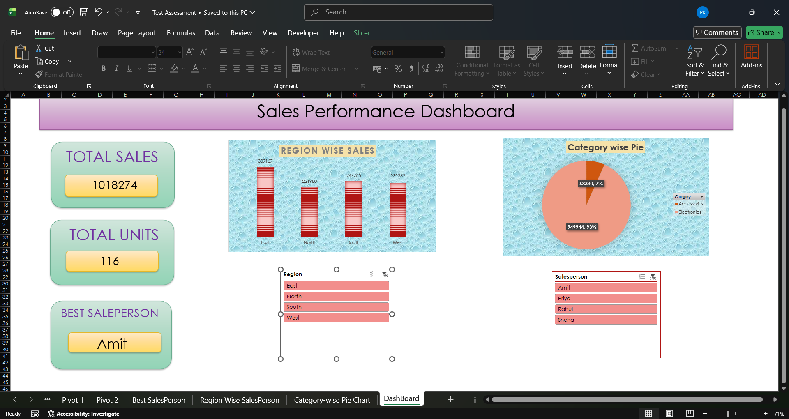

# 📊 Sales Performance Dashboard (Excel)

## Project Overview
This project is an interactive Sales Performance Dashboard created using Microsoft Excel. It helps analyze sales data through charts, pivot tables, slicers, and formulas.

## Features
- Total Sales KPI
- Total Units Sold
- Best Salesperson
- Region-wise Sales Analysis
- Category-wise Sales Analysis
- Interactive Slicers
- User-friendly Dashboard

## Tools Used
- Microsoft Excel
- Pivot Tables
- Pivot Charts
- Slicers
- Excel Formulas

## Skills Demonstrated
- Data Cleaning
- Data Analysis
- Dashboard Design
- Data Visualization
- Business Reporting

## Dashboard Preview

## Author
PN Kavitha
